# Enhanced ParamAI Studio Platform Content

## Executive Overview

ParamAI Studio is an enterprise-grade AI platform that combines intelligent automation with human expertise to deliver measurable business outcomes. Our platform addresses the fundamental challenges of enterprise AI implementation—connecting diverse data sources, enabling intelligent workflows, and delivering actionable insights with precision and transparency.

## Platform Architecture


## Our AI-Initiated, Human-Perfected Approach

ParamAI Studio is built on our "AI-Initiated, Human-Perfected" philosophy, which balances artificial intelligence with human expertise to deliver superior results.

| Approach | Process Flow | Key Advantages | Performance Metrics |
|----------|-------------|----------------|---------------------|
| **AI-Initiated** | Initiate → Analyze → Propose | Rapid processing, Pattern recognition, Continuous learning | Processing speed: 500ms avg. response time<br>Pattern detection: 94% accuracy |
| **Human-Perfected** | Review → Refine → Perfect | Domain expertise, Ethical oversight, Contextual understanding | Decision quality: 97% accuracy<br>Implementation confidence: 89% higher user trust |

## Core Components

### Lightning ⚡ RAG

An advanced Retrieval Augmented Generation platform that transforms how enterprises interact with their data. Lightning RAG enables intelligent conversations with all information sources through superior document processing, database connectivity, and natural language understanding.

#### Technical Specifications:
- **Processing Capability**: 10,000+ pages per minute
- **Query Response Time**: 85% faster than traditional RAG systems
- **Embedding Precision**: 92% semantic retrieval accuracy
- **Multi-format Support**: Processes 26 document types seamlessly
- **Connectivity**: 18 native database connectors, including SQL, MongoDB, and proprietary systems

#### Data Performance Metrics:
```mermaid
xychart-beta
    title "Lightning RAG Performance Benchmarks"
    x-axis [Semantic Accuracy, Information Extraction, Processing Speed, Query Complexity, Integration Depth]
    y-axis "Performance (% Improvement)" 0 --> 100
    bar [92, 87, 85, 74, 96]
    line [65, 58, 42, 51, 60]
    
    # Legend for the chart
    # Blue bars: Lightning RAG
    # Gray line: Industry Average
```

### Quantum Minds

A powerful low-code agentic AI workflow platform that enables enterprises to build intelligent agents that automate tasks, analyze data, and generate insights with minimal coding knowledge.

#### Technical Specifications:
- **Operator Categories**: 17 specialized operator types
- **Visual Builder**: Intuitive drag-and-drop interface with AI-assisted suggestions
- **AI Models**: Integration with 9 leading model providers
- **Deployment Flexibility**: On-demand, scheduled, and API-triggered execution options
- **Workflow Intelligence**: 73% reduction in workflow complexity vs. traditional systems

#### Workflow Efficiency Data:
| Process Type | Manual Process Time | Automated Process Time | Efficiency Gain | Error Reduction |
|--------------|---------------------|------------------------|-----------------|-----------------|
| Data Analysis | 4.7 hours | 8.3 minutes | 97.1% | 86% |
| Document Processing | 2.3 hours | 5.7 minutes | 95.9% | 93% |
| Compliance Reporting | 6.2 hours | 14.2 minutes | 96.2% | 97% |
| Market Intelligence | 8.4 hours | 21.6 minutes | 95.7% | 92% |
| Customer Analysis | 3.8 hours | 7.8 minutes | 96.6% | 89% |

## Competitive Landscape Analysis

ParamAI Studio offers a distinctive advantage in the enterprise AI market, combining capabilities that typically require multiple point solutions.

### Market Positioning Quadrant


### Capability Benchmark

| Capability | ParamAI | RAG Vendors | GenAI Platforms | Low-Code Tools |
|------------|---------|-------------|-----------------|----------------|
| **Multi-Source Data Access** | ●●●●● | ●●●●○ | ●●○○○ | ●●●○○ |
| **Low-Code Workflow Builder** | ●●●●● | ●●○○○ | ●●●○○ | ●●●●○ |
| **Human-in-the-Loop Controls** | ●●●●● | ●●●●○ | ●●●○○ | ●●○○○ |
| **Enterprise Security & Governance** | ●●●●● | ●●●○○ | ●●●●○ | ●●○○○ |
| **Implementation Speed** | ●●●●● | ●●●○○ | ●●○○○ | ●●●●○ |

### Strategic Differentiators


## Measurable Impact

ParamAI Studio delivers quantifiable business value across enterprises. Our platform has demonstrated consistent ROI improvements and operational efficiencies:

| Metric | Improvement | Industry Benchmark | Differential |
|--------|-------------|-------------------|-------------|
| **Analysis Cycle Time** | 60% reduction | 25% reduction | +35% |
| **Data Accuracy** | 40% improvement | 18% improvement | +22% |
| **Manual Task Reduction** | 70% decrease | 42% decrease | +28% |
| **User Satisfaction** | 85% positive rating | 64% positive rating | +21% |
| **Decision-making Confidence** | 78% increase | 45% increase | +33% |

### Time-to-Insight Comparison

```mermaid
%%{init: {"theme": "neutral", "themeVariables": {"primaryColor": "#4F46E5", "secondaryColor": "#666666"}}}%%
gantt
    title Time-to-Insight Comparison (hours)
    dateFormat HH:mm
    axisFormat %H:%M
    
    section Data Analysis
    Traditional Approach    :trad1, 00:00, 04:42
    ParamAI Studio         :para1, 00:00, 00:08
    
    section Document Processing
    Traditional Approach    :trad2, 00:00, 02:18
    ParamAI Studio         :para2, 00:00, 00:06
    
    section Compliance Reporting
    Traditional Approach    :trad3, 00:00, 06:12
    ParamAI Studio         :para3, 00:00, 00:14
    
    section Market Intelligence
    Traditional Approach    :trad4, 00:00, 08:24
    ParamAI Studio         :para4, 00:00, 00:22
```


## Industry Solutions

ParamAI Studio delivers transformative results across industries, with documented case studies and quantifiable outcomes:

### Manufacturing


| Metric | Improvement | Implementation Timeline | ROI Timeline |
|--------|-------------|------------------------|-------------|
| Predictive maintenance cost | 30% reduction | 8 weeks | 4 months |
| Quality control defects | 25% reduction | 6 weeks | 3 months |
| Supply chain efficiency | 20% improvement | 12 weeks | 6 months |

**Case Study Highlight:** A Fortune 500 manufacturer implemented ParamAI Studio to optimize equipment maintenance schedules. Using multi-source data integration, the platform analyzed sensor data, maintenance logs, and production schedules to predict equipment failures 72 hours earlier than previous systems, reducing downtime by 43% and saving $2.7M annually.

### Financial Services


| Metric | Improvement | Implementation Timeline | ROI Timeline |
|--------|-------------|------------------------|-------------|
| Risk assessment processing time | 70% reduction | 10 weeks | 5 months |
| Fraud detection accuracy | 40% improvement | 8 weeks | 3 months |
| Regulatory compliance effort | 1000+ person-hours saved annually | 12 weeks | 6 months |

**Case Study Highlight:** A global investment bank deployed ParamAI Studio to streamline risk assessment processes. By implementing our AI-initiated, human-perfected approach, they reduced false positives in fraud detection by 62% while improving detection rates by 40%, resulting in $4.2M savings from prevented fraud and $1.8M in operational efficiencies.

### Healthcare

```mermaid
sankey-beta
    Healthcare Data Processing
    Patient Data Analysis|35 [35]
    Administrative Automation|50 [50]
    Research Processing Speed|60 [60]
    
    Patient Data Analysis --> Better Diagnoses [30]
    Patient Data Analysis --> Reduced Readmissions [27]
    Administrative Automation --> Staff Efficiency [45]
    Administrative Automation --> Patient Satisfaction [31]
    Research Processing Speed --> Research Publications [35]
    Research Processing Speed --> Treatment Development [42]
```

| Metric | Improvement | Implementation Timeline | ROI Timeline |
|--------|-------------|------------------------|-------------|
| Patient data analysis accuracy | 35% improvement | 12 weeks | 7 months |
| Administrative task time | 50% reduction | 6 weeks | 3 months |
| Research data processing | 60% faster | 8 weeks | 5 months |

**Case Study Highlight:** A nationwide healthcare provider network used ParamAI Studio to analyze patient data across 28 facilities. The platform identified previously undetected patterns in treatment outcomes, leading to protocol adjustments that reduced readmission rates by 27% and improved patient satisfaction scores by 31%.

### Retail


| Metric | Improvement | Implementation Timeline | ROI Timeline |
|--------|-------------|------------------------|-------------|
| Inventory stockouts | 40% reduction | 8 weeks | 4 months |
| Customer behavior insights | 25% sales lift | 10 weeks | 6 months |
| Supply chain efficiency | 30% improvement | 12 weeks | 7 months |

**Case Study Highlight:** A multinational retailer implemented ParamAI Studio to optimize inventory across 840 locations. By connecting point-of-sale, supply chain, and external market data, the platform provided 14-day demand forecasts with 92% accuracy, reducing stockouts by 40% while decreasing excess inventory by 23%.

## Cross-Industry Impact Comparison

```mermaid
%%{init: {"theme": "neutral", "themeVariables": {"primaryColor": "#4F46E5"}}}%%
radar
  title "Cross-Industry Performance Metrics (% Improvement)"
  Manufacturing: 30,25,20,43,38
  Financial: 70,40,65,62,58
  Healthcare: 35,50,60,27,31
  Retail: 40,25,30,92,23
  axes: ["Cost Reduction", "Efficiency Gain", "Time Savings", "Error Reduction", "Performance Increase"]
```

## Enterprise-Grade Infrastructure

ParamAI Studio is built on a secure, scalable foundation designed for mission-critical enterprise operations.

### Security Framework

| Certification | Status | Description | Verification |
|---------------|--------|-------------|-------------|
| SOC 2 Type II | Certified | Comprehensive security audit | Annual independent audit |
| HIPAA Compliant | Verified | Healthcare data protection standards | Quarterly compliance review |
| GDPR Ready | Implemented | European data protection compliance | Continuous monitoring |
| ISO 27001 | Certified | Information security management | Biannual certification |

### Architectural Components


1. **Decentralized Architecture**
   - Partitioned vector collections for data isolation
   - Controlled AI access with granular permission models
   - 99.99% uptime guarantee with geographic redundancy

2. **Access Control**
   - Role-based access management at entity, collection, and record levels
   - Attribute-based permissions with contextual access rules
   - Comprehensive audit logging with tamper-resistant records

3. **Secure Collaboration**
   - End-to-end encryption for team interactions
   - Granular sharing controls with expiration policies
   - Cross-organization secure channels with federated authentication

4. **Deployment Flexibility**
   - Cloud-hosted SaaS with dedicated tenant isolation
   - On-premise deployment for air-gapped environments
   - Hybrid configurations with secure bridge architecture

## Implementation Process

ParamAI Studio follows a proven implementation methodology to ensure successful deployment and maximum value realization.


| Phase | Timeline | Activities | Deliverables |
|-------|----------|------------|-------------|
| **Discovery** | 2-3 weeks | Use case prioritization<br>Data source mapping<br>Integration planning | Implementation roadmap<br>Success metrics<br>Technical requirements |
| **Foundation** | 4-6 weeks | Core platform deployment<br>Identity integration<br>Data source connections | Functional platform<br>Initial integrations<br>Security verification |
| **Acceleration** | 6-8 weeks | Use case implementation<br>Custom workflow creation<br>User training | Operational use cases<br>Automated workflows<br>Trained user base |
| **Optimization** | Ongoing | Performance monitoring<br>Model fine-tuning<br>Capability expansion | Optimization reports<br>Enhanced models<br>Expanded use cases |

### Implementation Success Rate


## Customer Satisfaction and ROI


## Start Your Enterprise AI Journey

ParamAI Studio is ready to transform your organization's approach to data, insights, and intelligent automation. Our platform delivers measurable value with enterprise-grade security and scalability.

### Next Steps

1. **Schedule a Consultation**: Discuss your specific use cases and requirements with our solution architects
2. **Proof of Concept**: Experience ParamAI Studio with your own data in a controlled environment
3. **Implementation Planning**: Develop a tailored implementation roadmap for your organization
4. **Deployment**: Deploy ParamAI Studio with our expert implementation team
5. **Value Realization**: Measure and optimize your return on investment

### Contact Information

- **Website**: [www.paramai.studio](https://www.paramai.studio)
- **Email**: enterprise@paramai.studio
- **Phone**: +91 9845120421